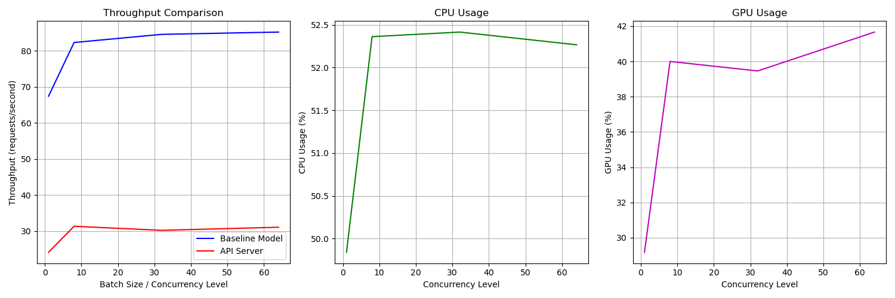
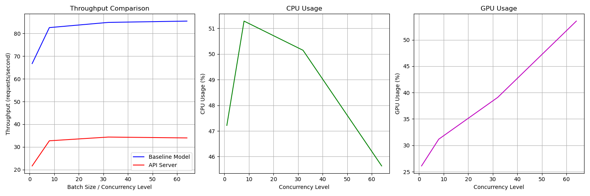
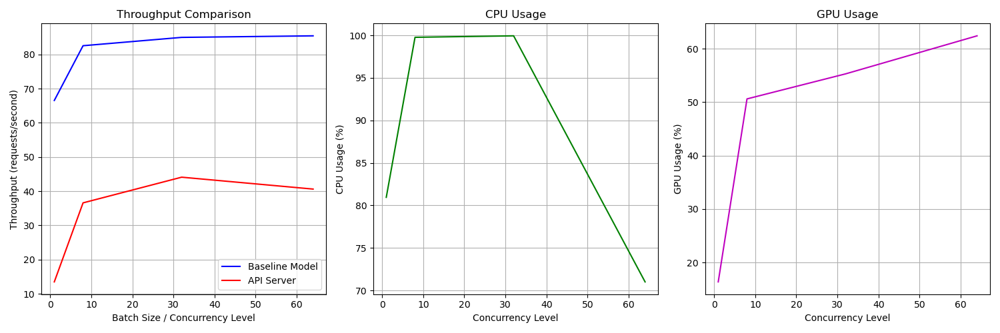
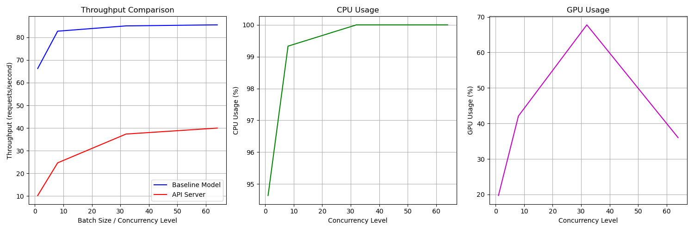
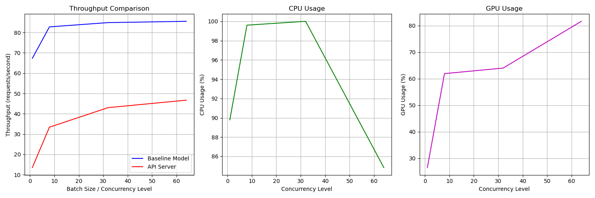
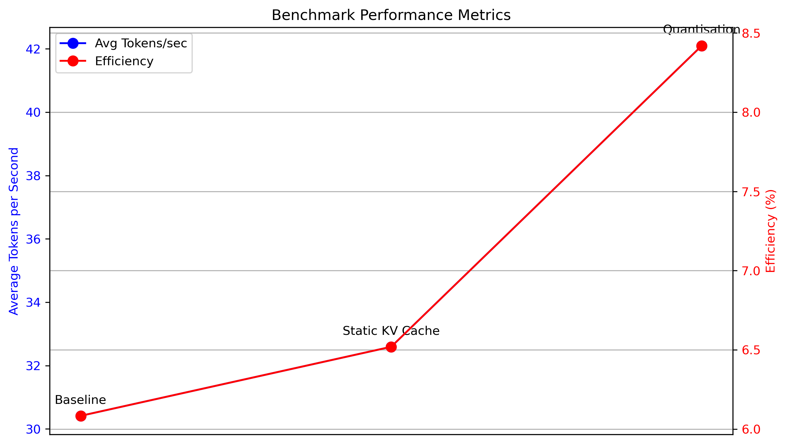

# 📊 Throuhgput Benchmarking using LITSERVE

In this project we have utilised [Litserve](https://lightning.ai/docs/litserve/home) to benchmark performance of:
- [Image classification model (MNIST)](#mnist-model-benchmarking-analysis)
- [Small Language Model (Smol LM)](#small-language-model-benchmarking)


The objective is to evaluate and optimize the performance of above model's inference under different optimization strategies, focusing on both throughput and API performance metrics. For entire experimentation we will be using **LITSERVE** as our inference server. 

# [MNIST Model Benchmarking Analysis](https://github.com/Himank-J/LitServe-Benchmarking/tree/main/mnist_model_benchmarking)

Here we have used a simple MNIST model trained using Pytorch lightning. This model inferenceing is optimised using below techniques and the results are benchmarked.

Contents:
- [Approaches](#approaches-implemented)
- [Results & Comparison](#results)
- [Conclusion](#conclusion)
- [Future Improvements](#future-optimization-opportunities)
  
---

## Approaches Implemented

### 1. [Initial Implementation (Baseline)](#results)
Standard Litserve inference without any optimizations:
- Basic forward pass through the model
- Single image processing at a time
- No parallel processing or optimization techniques

### 2. [Batching](#results)
Processes multiple images simultaneously to leverage GPU parallelization:
- Groups images into fixed-size batches
- Reduces GPU memory transfers
- Better utilization of GPU compute capabilities
- Optimal for scenarios with multiple simultaneous requests

**Accepting batch of images from the client:**
```python
def batch(self, inputs):
   """Process and batch multiple inputs"""
   batched_tensors = []
   for image_bytes in inputs:
      # Decode base64 string to bytes
      img_bytes = base64.b64decode(image_bytes)
      
      # Convert bytes to PIL Image
      image = Image.open(io.BytesIO(img_bytes))
      # Transform image to tensor
      tensor = self.transforms(image)
      batched_tensors.append(tensor)
      
   # Stack all tensors into a batch
   return torch.stack(batched_tensors).to(self.device)
```

**Configuring the server:**
```python
server = ls.LitServer(
   api,
   accelerator="gpu",
   max_batch_size=64,  
   batch_timeout=0.01
)
```

### 3. [Batching with Workers](#results)
Combines batch processing with parallel CPU workers:
- Uses thread pool for parallel image preprocessing
- Maintains batch processing for GPU inference
- Balances CPU and GPU workloads
- Reduces preprocessing bottlenecks

**Configuring the server:**
```python
server = ls.LitServer(
   api,
   accelerator="gpu",
   max_batch_size=64,  
   batch_timeout=0.01,
   workers_per_device=4 # Number of workers per GPU
)
```

### 4. [Parallel Decoding](#results)
Focuses on optimizing the image preprocessing pipeline:
- Parallel image decoding using multiple CPU threads
- Asynchronous image loading and preprocessing
- Reduces CPU bottlenecks in image preparation
- Efficient for large images or complex preprocessing

**Accepting batch of images from the client and decoding them in parallel:**
```python
def batch(self, inputs):
   """Process and batch multiple inputs using parallel processing"""
   def process_single_image(image_bytes):
      # Decode base64 string to bytes
      img_bytes = base64.b64decode(image_bytes)
      
      # Convert bytes to PIL Image
      image = Image.open(io.BytesIO(img_bytes))
      # Transform image to tensor
      return self.transforms(image)
      
   # Create a thread pool with max workers being either batch size or CPU count
   with ThreadPoolExecutor(max_workers=max(len(inputs), os.cpu_count())) as pool:
      batched_tensors = list(pool.map(process_single_image, inputs))
      
   # Stack all tensors into a batch
   return torch.stack(batched_tensors).to(self.device)
```

### 5. [Half Precision (FP16)](#results)
Utilizes reduced precision arithmetic for faster computation:
- Converts model weights to 16-bit floating-point
- Reduces memory bandwidth requirements
- Faster arithmetic operations on compatible GPUs
- Lower memory footprint for model storage

```python
precision = torch.bfloat16 # using bfloat16 for half precision
self.model.to(self.device).to(precision) # converting model to half precision
```

```python
torch.stack(batched_tensors).to(self.device).to(precision) # converting batch of tensors to half precision
```

---

## Results

**Impact on Throughput, CPU and GPU Utilisation:**

**Baseline:**


**After Batching:**


**After Batching with Workers:**


**After Parallel Decoding:**


**After Half Precision:**


**NOTE - After parallel decoding, the throughput is not as good as the other optimizations. This is because the overhead of decoding the images in parallel outweighs the benefits of parallel processing. So half precision was implemented without parallel decoding.**

---

### 1. Baseline Throughput Comparison (Images/second)

| Batch Size | Initial | Batching | Batching+Workers | Parallel Decoding | Half Precision |
|------------|---------|----------|------------------|-------------------|----------------|
| 1          | 67.38   | 66.70    | 66.54           | 66.24            | 67.29          |
| 8          | 82.28   | 82.53    | 82.56           | 82.72            | 82.79          |
| 32         | 84.54   | 84.82    | 85.00           | 85.05            | 84.89          |
| 64         | 85.18   | 85.40    | 85.45           | 85.51            | **85.53**          |

### 2. API Performance Comparison (Requests/second)

| Concurrency | Initial | Batching | Batching+Workers | Parallel Decoding | Half Precision |
|-------------|---------|----------|------------------|-------------------|----------------|
| 1           | 24.12   | 21.67    | 13.46           | 10.22            | 13.51          |
| 8           | 31.32   | 32.72    | 36.58           | 24.64            | 33.41          |
| 32          | 30.20   | 34.37    | 44.09           | 37.35            | 43.03          |
| 64          | 31.06   | 33.99    | 40.62           | 39.97            | **46.71**          |

### Key Observations:

1. **Baseline Throughput**:
   - All approaches show similar baseline throughput patterns
   - Marginal improvements as batch size increases
   - Half Precision shows slightly better performance at higher batch sizes

2. **API Performance**:
   - **Batching+Workers shows significant improvement at higher concurrency levels**
   - **Half Precision performs best at highest concurrency (64), reaching 46.71 req/s**
   - Initial implementation performs better at low concurrency but doesn't scale well
   - Parallel Decoding shows lower performance at low concurrency but scales reasonably well

3. **Best Performers**:
   - For low concurrency (1): Initial implementation (24.12 req/s)
   - For high concurrency (64): Half Precision (46.71 req/s)
   - Best scaling: Batching+Workers and Half Precision


## Conclusions

1. **Optimization Impact**:
   - Batch processing provides consistent improvements across all batch sizes
   - Worker-based approaches show better scaling with increased concurrency
   - Half precision offers the best performance at high concurrency levels

2. **Use Case Recommendations**:
   - For single-request scenarios: Use the initial implementation
   - For high-concurrency production environments: Implement half precision with batching
   - For balanced performance: Use batching with workers

3. **Performance Scaling**:
   - Throughput improvements plateau around batch size 32
   - API performance continues to scale up to 64 concurrent requests
   - Half precision shows the best overall scaling characteristics

## Future Optimization Opportunities

1. Implement dynamic batch sizing based on load
2. Explore mixed precision training
3. Investigate GPU memory optimization techniques
4. Consider implementing request queuing for better resource utilization

---

# [Small Language Model Benchmarking]((https://github.com/Himank-J/LitServe-Benchmarking/tree/main/llm_model_benchmarking)

Contents:
- [Approaches](#approaches-implemented)
- [Results & Comparison](#results)
- [Conclusion](#conclusion)

---

## Approaches

### 1. [Initial Implementation (Baseline)](#results-slm)
Standard Litserve inference without any optimizations:
- Basic chat conversation with Model
- Single message processing at a time
- No parallel processing or optimization techniques

### 2. [Static KV Cache & Torch Compile](#results-slm)

During decoding, a LLM computes the key-value (kv) values for each input token and since it is autoregressive, it computes the same kv values each time because the generated output becomes part of the input now. This is not very efficient because you’re recomputing the same kv values each time.

To optimize this, you can use a kv-cache to store the past keys and values instead of recomputing them each time.

```python
self.model.generation_config.cache_implementation = "static"
self.model.forward = torch.compile(
    self.model.forward, 
    mode="reduce-overhead",
    fullgraph=True
)
```

### 3. [Quantisation](#results-slm)

Quantization reduces the size of the LLM weights by storing them in a lower precision. This translates to lower memory usage and makes loading LLMs for inference more accessible if you’re constrained by your GPUs memory. 

```python
quant_config = BitsAndBytesConfig(
    load_in_8bit=True,  # Enable 8-bit quantization
)
self.model = AutoModelForCausalLM.from_pretrained(
    checkpoint,
    quantization_config=quant_config,  # Apply quantization
    torch_dtype=torch.bfloat16,
    device_map=device
)
```

---

## Results-SLM



As seen from above graph with Static KV we gave slight increase in tokens/sec but with Quantisation we are able to achieve signifcant increase. For more detailed metrics view [benchmark_results.json](llm_model_benchmarking/metrics/benchmark_results.json)

---

## References:

1.) [Phi-3.5 Mini Instruct](https://huggingface.co/microsoft/Phi-3.5-mini-instruct)
2.) [LLM Optimisations](https://huggingface.co/docs/transformers/main/en/llm_optims)
3.) [Litserve](https://lightning.ai/docs/litserve/home)
